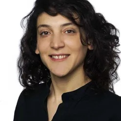

## About Me

     
How seemingly irregular, spiky brain activity gives rise to our rich subjective experience and our ability to interact with the environment, reflect, think, and discover? 
I am a biologist and experimental neuroscientist and am interested in unveiling the brain mechanisms underlying consciousness and cognition. My current research is on the role of neuromodulatory systems on behavior and brain activity and dynamics. This is challenging in humans, and therefore I am employing a variety of methods, including pharmacology, MRI and neurophysiological measures such as pupillometry and EEG. I am also interested in the use of AI in research and the scientific practice.

My work focuses on **slow brain dynamics**, **neuromodulation**, and **behavior**, combining experimental and computational approaches.

I am currently a researcher at the Brain plasticity and psychiatry lab at Oslo University Hospital, Norway.

 
---

<!## Reflections on Discovery>

> There is nothing so easy as what was discovered yesterday,  
> nor so difficult as what will be discovered tomorrow.  
> — Jean-Baptiste de Biot

---

## Research Focus

I pursue two main lines of research. 

I) Modulation of slow brain dynamics

I investigate how slow fluctuations in brain activity and neuromodulatory systems:

- Shape ongoing brain dynamics across multiple time scales  
- Influence cognition and behavior  
- Can be modelled and understood using computational and theoretical frameworks

II) The human brainstem neuromodulatory systems

I investigate brainstem nuclei characteristics in health and disease:

- Strong methodological development and validation for better localisation of small brainstem nuclei  
- Relation to lifestyle, cognition and behavior  
- Use of AI to apply analyses on large samples  

For more details, see the **[Research](/research/)** page.

---

## Teaching & Mentoring

I teach and supervise students in areas related to neuroscience, brainstem MRI, and brain dynamics, and I am particularly interested in:

- Helping students bridge theory and experiment  
- Encouraging critical thinking about methods and data  
- Supporting diverse trajectories into systems and clinical neuroscience  

You can find more information on courses and supervision on the **[Teaching](/teaching/)** page.

---

## Highlights

- Latest publication: *Large-scale neuroimaging and genetic analyses of the human thalamus in loneliness* (2026) – Structural thalamic signatures in loneliness, dependent on frequency of social contact, and with possible shared genetics with development.
- Latest review: *Infra-slow brain fluctuations: a taxonomy of mechanistic hypotheses* (2026) – A comprehensive review of infra-slow brain activity, and a proposed framework on the brain balance between activation and regulation.  
- Recent conference attendance: *FENS 2026, Barcelona* – I presented our current work on brainstem MRI in a large, large sample.
- Recent conference attendance: *OHBM 2026, Bordeaux* – I presented my latest work on psychedelics effects on brain dynamics.  
<!-- New blog post: *Post title* – see the **[Blog](/blog/)** page for reflections on academia and neuroscience. -->

For a full overview of my positions, publications, and grants, visit my **[CV](/cv/)** page.

---

## Contact & Connect

I welcome inquiries from prospective students, collaborators, and anyone interested in slow brain dynamics, neuromodulation, and behavior.

- Email: [veroniex@uio.no](mailto:veroniex@uio.no)  
- GitHub: [VeronicaMaki-Marttunen](https://github.com/VeronicaMaki-Marttunen)  
- LinkedIn: [Verónica Mäki-Marttunen](https://www.linkedin.com/in/veronicamaekimarttunen/)

You are welcome to get in touch regarding collaborations, student projects, or outreach activities.
